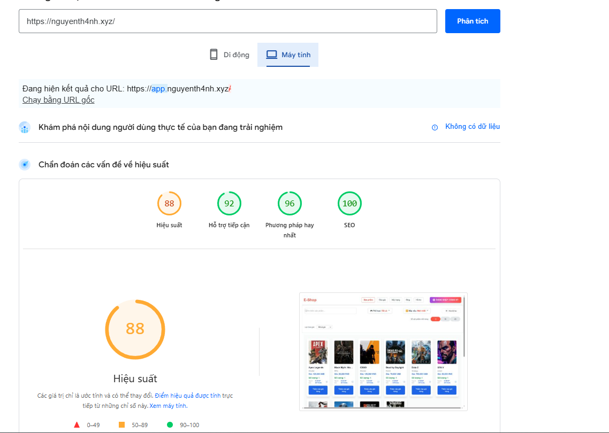

# 💪 ĐỒ ÁN CUỐI KỲ - NHÓM 6

## 🌐 Lập Trình Ứng Dụng Web

### 🎯 ĐỀ TÀI: WEBSITE MUA BÁN VẢT PHẨM, TÀI SẢN ẢO ONLINE, TIN CẤY

> Ví dụ: Game items, tài khoản game, CD-Key phần mềm, v.v.

---

## 🚀 Giới thiệu

Website cung cấp nền tảng trung gian giúc người dùng **mua bán tài sản ảo** một cách an toàn và đáng tin cậy. Hệ thống tích hợp các tính năng hiện đại như:

* **Thanh toán an toàn qua cơ chế Escrow**
* **Đấu giá trực tuyến thời gian thực bằng SignalR**
* **Đánh giá và xếp hạng người bán**
* **Tìm kiếm sản phẩm thông minh**

---

## 🧑‍💻 Thành viên & Đóng góp

| STT | Họ tên            | Đóng góp chính                                                                 | Tỷ lệ |
| --- | ----------------- | ------------------------------------------------------------------------------ | ----- |
| 1   | Nguyễn Thanh      | Gateway Service, Order Service, Buying Service, Notification, Search, Frontend | 40%   |
| 2   | Nguyễn Nhất Dương | Auction Service, Bidding Service, Frontend                                     | 20%   |
| 3   | Nguyễn Hoàng Phúc | Identity Service, Wallet Service, Frontend                                     | 20%   |
| 4   | Huỳnh Anh Khôi    | Auction Service, Bidding Service, Frontend                                     | 20%   |

---

## ⚙️ Công nghệ sử dụng

* **Ngôn ngữ:** C#, TypeScript
* **Backend:** ASP.NET Core
* **Frontend:** Next.js (TypeScript + Tailwind)
* **Realtime Communication:** SignalR
* **Database:** PostgreSQL, MongoDB
* **Thiết kế UI:** Figma
* **Triển khai:** Docker Compose
* **Message Broker:** RabbitMQ

---

## 🧠 Tổng quan hệ thống

Hệ thống được xây dựng theo kiến trúc **microservices**, chia nhỏ chức năng thành các dịch vụ độc lập, dễ bảo trì và mở rộng. Mỗi service đảm nhận một vai trò cụ thể và giao tiếp với nhau thông qua **RabbitMQ** – giúp tăng khả năng xử lý bất đồng bộ, giảm độ trễ và tăng độ ổn định hệ thống.

### 🏗️ Các thành phần chính trong hệ thống:

| Service                | Vai trò chính                                                        |
| ---------------------- | -------------------------------------------------------------------- |
| `Identity Service`     | Xác thực người dùng, quản lý đăng nhập, đăng ký, xác minh OAuth2     |
| `Wallet Service`       | Quản lý ví điện tử, số dư, giao dịch, tích hợp cổng nạp tiền VNPAY   |
| `Order Service`        | Xử lý đơn hàng mua hàng trực tiếp, tích hợp cơ chế Escrow            |
| `Buying Service`       | Quản lý giỏ hàng, xử lý quá trình thanh toán sản phẩm                |
| `Auction Service`      | Tạo phiên đấu giá, quản lý thông tin sản phẩm đấu giá                |
| `Bidding Service`      | Đặt giá đấu thầu thời gian thực thông qua SignalR                    |
| `Notification Service` | Gửi thông báo realtime đến người dùng khi có sự kiện                 |
| `Search Service`       | Tìm kiếm sản phẩm theo tên, từ khóa, loại, người bán,...             |
| `Gateway Service`      | API Gateway trung tâm – định tuyến request đến các service tương ứng |
| `Frontend`             | Giao diện người dùng xây dựng bằng Next.js + Tailwind CSS            |

---

🌍 Website đã triển khai thực tế

Hệ thống đã được triển khai và hoạt động tại các tên miền sau:

Website chính: https://nguyenth4nh.xyz👉 Tự động chuyển hướng đến: https://app.nguyenth4nh.xyz

Trang đăng nhập / xác thực: https://id.nguyenth4nh.xyz

Hệ thống API backend: https://api.nguyenth4nh.xyz

---
📊 Google PageSpeed Insights

Hệ thống frontend được tối ưu hiệu năng tốt, kiểm tra thông qua Google PageSpeed Insights:

Hiệu suất được chấm điểm ở mức cao (Desktop/Mobile)

Tối ưu hình ảnh, preload fonts, lazy loading hợp lý

📷 Ảnh minh hoạ kết quả PageSpeed:



### 🛠 Hệ thống hỗ trợ:

* **Realtime**: sử dụng `SignalR` để cập nhật thông tin đấu giá tức thì.
* **An toàn**: triển khai mô hình **Escrow** giúp bảo vệ người mua và người bán khỏi gian lận.
* **Tin cậy**: hỗ trợ đánh giá, bảng xếp hạng người bán, và lịch sử giao dịch rõ ràng.
* **Mở rộng dễ dàng**: nhờ kiến trúc microservices và container hóa bằng Docker.


## 🔧 Hướng dẫn chạy ứng dụng

### 1️⃣ Cài đặt Docker

* Tải và cài đặt tại: [https://www.docker.com/](https://www.docker.com/)

### 2️⃣ Chạy ứng dụng theo môi trường

#### 🧪 Môi trường **Test (backup2)**

* Sử dụng file: `docker-compose.backup2`
* Đổi tên file này thành `docker-compose.yml`:

```bash
mv docker-compose.backup2 docker-compose.yml
```
 Khởi chạy Frontend

* bash
cd frontend/web
npm install
npm run dev
```

* Khởi chạy Backend:

```bash
docker compose up -d --build
```

#### 💻 Môi trường **Production cục bộ (Local)**

* Sử dụng file: `docker-compose.backup3`
* Đổi tên file này thành `docker-compose.yml`:

```bash
mv docker-compose.backup3 docker-compose.yml
```

* Khởi chạy Backend:

```bash
docker compose up -d --build
```

#### 🌐 Môi trường **Production triển khai Internet**

* Sử dụng file: `docker-compose.yml` hiện tại (mặc định)
* Chạy lệnh:

```bash
docker compose up -d --build
```

---


## 🚀 Tính năng chính

### 🔐 Xác thực người dùng (Identity Service)

* Đăng ký / đăng nhập hệ thống hoặc qua **Google OAuth2**
* Hỗ trợ xác thực đa yếu tố qua email hoặc số điện thoại
* Bảo mật thông qua JWT Token

---

### 💳 Ví điện tử (Wallet Service)

* Nạp tiền qua cổng **VNPAY (sandbox)**
* Quản lý số dư, rút tiền và xem lịch sử giao dịch minh bạch

---

### 🛒 Hệ thống mua hàng & cơ chế **Escrow**

#### ⚙️ Mô hình Escrow là gì?

**Escrow** là cơ chế trung gian giúp đảm bảo an toàn khi giao dịch online. Hệ thống sẽ **giữ tiền** của người mua cho đến khi người bán giao **key sản phẩm** hợp lệ.

#### 👉 Quy trình Escrow:

1. Người mua thanh toán → **hệ thống giữ tiền**
2. Người bán giao **key sản phẩm**
3. Người mua xác nhận:

   * ✅ Nếu key hợp lệ → tiền được **giải phóng** cho người bán
   * ❌ Nếu key sai → tiền được **hoàn lại** cho người mua

> ✅ Tính năng giúc bảo vệ người dùng khỏi gian lận hoặc giao dịch lỗi.

---
### 🏪 Mua sản phẩm

* Người dùng có thể tạo giỏ hàng, mua được nhiều sản phẩm cùng lúc, sản phẩm sẽ được gửi qua mail
* Người dùng cần xác thực sản phẩm để đảm bảo quyền lời cho mình

---

### 🏪 Bán sản phẩm

* Đăng bán sản phẩm kèm ảnh, mô tả, giá, số lượng
* Quản lý danh sách sản phẩm
* Xử lý đơn hàng từ người mua: xác nhận giao hàng, nhận tiền từ Escrow

---

### 🏆 Đấu giá trực tuyến (Auction Service)

#### 📡 Sử dụng SignalR cho realtime

* Cập nhật **giá đấu mới nhất** và người thắng **theo thời gian thực**
* Không cần reload trang, trải nghiệm mượt mà

#### ⏱️ Quy trình:

1. Người bán tạo phiên đấu giá với thời gian kết thúc cụ thể
2. Người dùng tham gia đặt giá
3. Khi đấu giá kết thúc:

   * Người thắng sẽ nhận **key**
   * Tiền được giữ lại bởi **Escrow**
   * Người thắng xác nhận key → tiền chuyển cho người bán hoặc được hoàn lại

---

### 📈 Đánh giá & bảng xếp hạng người bán

* Sau mỗi giao dịch, người mua có thể **đánh giá người bán**
* Bảng xếp hạng người bán dựa trên:

  * Điểm trung bình đánh giá
  * Số lượt bán hàng thành công

---

## 📌 Tổng kết

Đồ án là một hệ thống giao dịch thương mại điện tử chuyên biệt cho tài sản ảo với:

* Kiến trúc **microservices** phân tách rõ ràng, dễ mở rộng
* Giao tiếp giữa các service qua **RabbitMQ**
* Hệ thống **Escrow** và **đấu giá realtime** nâng cao độ tin cậy


